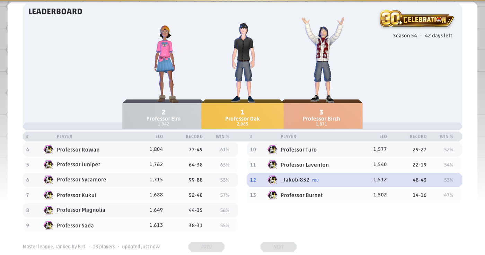

# PTCGL Leaderboard & Match History

# [📖 Installation guide →](docs/INSTALL.md)


A mod for **Pokémon TCG Live** that adds two things the game should have had from the start:

- **Match History**: every game you play, with the result, prizes, turns, time taken, your
  opponent's deck and the battle log.
- **Leaderboard**: a community ranking of Master league players by ELO for the current season,
  with the top three on a 3D podium wearing their own avatars.

It only works in the menus. **It shows nothing and reads nothing during a match** apart from the
start and the result, so there is no in-match advantage. It appears as native tabs in the game's
own top bar, with a single on/off switch under **Settings → General**.



## What is shared

Only your own season record goes to the leaderboard: your in-game name, rank points (ELO and season
exp), wins and losses, and the item ids of the outfit your avatar wears, so other players' games can
draw you on the podium. You are identified by a random ID the mod creates, not your Pokémon Trainer
Club account. Nothing about your opponents is ever sent. Your match history stays on your computer,
in `%LOCALAPPDATA%\PtcglLeaderboard`.

## Will I get banned for using this?

**Most likely no.** Nobody can promise it, but here's why the risk is low.

- **I've been modding the game for over a year without a ban**, and I'm not aware of anyone being
  banned for using mods like this. Pokémon TCG Live has no anti-cheat that looks for them.
- **It's built to give no advantage.** During a match it only notes that one started and how it
  ended: it doesn't show you anything, doesn't automate anything, and doesn't change cards, decks or
  games. It sends nothing to The Pokémon Company. The only thing it sends anywhere is your own season
  record, to this mod's leaderboard.
- **But it is a modification of the game**, and game terms generally don't allow third-party mods,
  so using this (like any mod) is technically against them. The Pokémon Company could change how
  they handle that at any time.

If that risk isn't for you, don't install it. If you do and change your mind, uninstalling puts the
game back exactly as it was.

## How it works

- **A BepInEx plugin**, injected with BepInEx 5. It reuses the game's own screens, fonts, sprites
  and avatar renderer, so the new tabs look like part of the game rather than an overlay.
- **Match results** come from the client's real match state (`MatchManager` / `MatchLogic`), read
  when a match starts and when it ends.
- **The season** (its id, end date, league ladder and plaque art) comes from the client's own
  cached season config. Nothing is hardcoded, so a new season is picked up automatically, including
  a reset while the game is running.
- **The leaderboard service** is a Cloudflare Worker with a D1 database (`leaderboard/`). The plugin
  submits your season record at startup and after each match.
- **The launcher** (`Launcher/`) is what the desktop shortcut starts. A PTCGL update can strip the
  BepInEx injector out of the game folder, and a plugin that isn't loaded can't repair itself, so
  the launcher checks the install against a pristine copy in `%LOCALAPPDATA%`, starts the game, and
  watches for an update removing it. It also checks GitHub for a newer release at most once a day and, if there
  is one, offers to open the download page. It never downloads or runs anything itself.

The installer lives in a separate repo, `ptcgl-leaderboard-installer` (Inno Setup, per-user, no
admin).

## Building

Requires the .NET SDK and a local PTCGL install; the game's DLLs are referenced from its folder.
Game paths can be overridden with `/p:GameRoot="…"`.

```
dotnet build PtcglLeaderboard.csproj -c Debug     # dev loop
dotnet build PtcglLeaderboard.csproj -c Release   # what ships
```

- **Debug** is the dev loop. It deploys to `BepInEx\scripts` for ScriptEngine hot reload (press F6
  in game), and includes the dev tools: UI/texture probes, the live-tuning file and the F3/F4 deck
  keys.
- **Release** is what the installer packages. It has none of the dev tools, no hotkeys, and writes
  nothing beside the game. It isn't copied into the game folder; `build.ps1` in the installer repo
  stages it.

Never have both on one machine: a Debug copy in `scripts\` plus an installed copy in `plugins\` loads
the plugin twice.

The leaderboard service:

```
cd leaderboard
node --test test.js          # 19 end-to-end tests against a real SQLite
npx wrangler deploy
```

The worker and database are named `prizetracker-leaderboard` for historical reasons. That name is
the deployed URL, so don't rename it.

## Data

| what | where |
|---|---|
| match history, avatar cache, player-id backup | `%LOCALAPPDATA%\PtcglLeaderboard` |
| settings (`ptcgl.leaderboard.cfg`) | `BepInEx\config` |
| launcher, repair payload, manifest, repair log | `%LOCALAPPDATA%\PtcglLeaderboard` |

Player data deliberately lives outside the game folder, because a PTCGL update can wipe the game
folder. Uninstalling removes the mod's own files and keeps your match history.

## Questions, bugs, ideas

Message me on Discord: **jakobi_**

## Licence

MIT - see [LICENSE](LICENSE). The installer bundles BepInEx, Unity Doorstop, HarmonyX, MonoMod and
Mono.Cecil under their own licences; see the notices in the
[installer repo](https://github.com/Jxkobyte/ptcgl-leaderboard-installer).

*Unofficial fan-made mod. Not affiliated with, endorsed by, or connected to The Pokémon Company,
Nintendo, Creatures or GAME FREAK. Pokémon and Pokémon TCG Live are trademarks of their respective
owners. Use at your own risk.*
